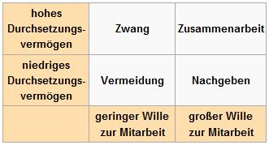

Ein Konflikt erfüllt grundsätzlich folgende Bedingungen:

* Konflikte sind Meinungsverschiedenheiten zwischen mindestens zwei voneinander abhängigen Personen
* Mindestens eine Person empfindet eine Unvereinnehmbarkeit mit persönlichen Werten, Bedürfnissen oder Zielen

Ein Konflikt kann über 3 unterschiedliche Dimensionen gelöst werden:

| Regeln                                                            | Macht                                                                                              | Bedürfnisse                                                                           |
|:------------------------------------------------------------------|:---------------------------------------------------------------------------------------------------|:--------------------------------------------------------------------------------------|
| * Gesetze   * Verordnungen   * Verträge   * Bestimmungen | * Hierarchische Stellung   * Wissensvorsprung   * Fachliche Überlegenheit   * Beziehungen | * Gemeinsamkeiten   * Verhandlungen   * Empathie   * Erarbeiten von Lösungen |

## Konflikte lösen

### Lösungsstrategien

#### Durchsetzen / Eskalieren

Auf Konfrontation gehen und seine eigenen Absichten durchsetzen. "Die Orange gehört voll und ganz mir! - Ich gewinne!"

**Intervention** : Macht / Regeln

#### Verhandeln

Die Konfliktsituation verändern und gemeinsam nach Problemlösungen suchen. "Ich benötige den Saft, für was benötigst Du die Orange? - Ich benötige die Schale, um einen Kuchen zu backen."

**Intervention** : Bedürfnisse

#### Kompromiss

Gegenseitig Zugeständnisse machen und einen Kompromiss aushandeln. "Wir teilen die Orange, keiner gewinnt, keiner verliert."

**Intervention** : Bedürfnisse

#### Vermeiden

Konflikt nicht wahrnehmen oder ignorieren.

**Intervention** : Keine / Bedürfnisse (ich stelle meine Bedürfnisse zurück)

#### Nachgeben

Im Konflikt nachgeben und sich den Bedürfnissen anderere anpassen.

**Intevention** : Keine / Bedürfnisse (ich stelle meine Bedürfnisse zurück)

### EVA

| Phase           | Verhalten des/der Vorgesetzten                                                                                                                                                                                                                                                                                               |
|:----------------|:-----------------------------------------------------------------------------------------------------------------------------------------------------------------------------------------------------------------------------------------------------------------------------------------------------------------------------|
| **E**inleitung  | * Sagt, worum es im Gespräch geht und was das Ziel des Gespräches ist   * Formuliert den Konflikt nach FEZ   * Fordert auf, dies ebenfalls zu tun   * Fragt nach, welche Punkte aus seiner Sicht den Konfligt ausmachen   * Zeigt sich ruhig, empathisch und sachlich; auch wenn der Mittarbeiter emotional wird |
| **V**erhandlung | * Fast zusammen, in welchen Punkten konkret Uneinigkeit herrscht ("Inventarliste")   * Verhandelt Punkt für Punkt und akzeptiert auch mal den Standpunt des anderen   * Sucht nach gemeinsamen Lösungen   * Versteht es, über Fragen und nicht über Macht/Regeln zu intervenieren                                   |
| **A**bschluss   | * Fasst die Resultate zusammen   * Holt ab, ob die Lösungen auch stimmig sind   * Vereinbart die konkreten Vorgehensschritte und Kontrollpunkte                                                                                                                                                                        |
