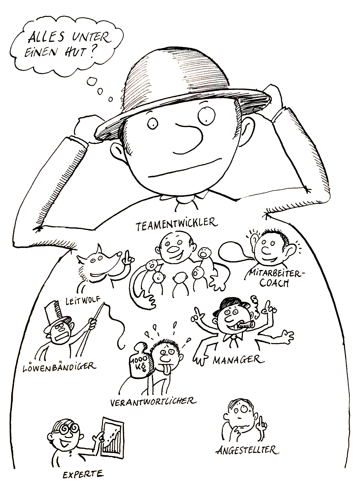

# Kommunikation

## Stimmige Führung

### Souveränität erster Ordnung

Wer auf Souveränität 1. Ordnung aus ist, der versucht, immer "Herr der Lage zu sein", jede Situation optimal zu meistern, sich keine Blösse zu geben, unangreifbar und unverwundbar zu sein, kurzum: ein perfekter Profi, der keine menschlichen Schwächen, Verwundbarkeiten kennt, der durch nichts und niemanden zu beirren ist, der sich keine Nachdenklichkeit anmerken lässt.

### Souveränität zweiter Ordnung

Bei der Souveränität 2. Ordnung geht es darum eine Verbindung von Professionalität und Menschlichkeit zu machen. Es wird ein Verständnis von Professionalität bevorzugt, welches ein menschliches Anlitz trägt. Die menschlichen Schwächen und Fehlbarkeiten, menschliche Empfindlichkeiten und momentane Verwirrtheiten werden eingeschlossen.

### Die "Sandwich-Position"

Am Beispiel von Humanität und Effiktivität kann man gut das Spannungsfeld aufzeigen, in welchem sich eine Führungskraft zuweilen befindet. Um nicht nicht von einem Extrem (Rücksichtsloses Profitstreben vs übertriebenenes Sozialgebahren) zu fallen, gilt es die positiven Werte Effektivität und Humanität gut auszubalancieren. Hier handelt es sich jedoch nicht um eine statische sondern vielmehr um eine dynamische und situationsabhängige Balance.

Mit dem Werte- und Entwicklungsquadrat kann man auch gut aufzeigen wie die beiden Werte Effektivität und Humanität in einem positiven Spannungsverhältnis stehen. Es handelt sich hier um zwei positive Ausrichtungen, welche jedoch nur für sich genommen, ohne den Ausgleich der anderen Seite, Gefahr laufen, in ein negatives Extrem abzurutschen.

In ihrem Alltag bekommt eine Führungskraft die Gegensätzlichkeit dieser und anderer Anforderungen oft dadurch unmittelbar zu spüren, dass sie von unterschiedlichen Personen an sie gestellt werden, es besteht ein so genannter Intra-Rollenkonflikt. Da diese Anforderungen of von oben und von unten gestellt werden, nennt man diesen Intra-Rollenkonflikt auch die "Sandwich-Position".

Um nun nicht tatsächlich als "armes Würstchen" in der Sandwich-Position eingequetscht zu werden, sollte eine Führungskraft ihre eigene Linie entwickeln. Sie sollte eine klare Vorstellung davon haben, was sie als ihre Aufgabe sieht und was nicht, wo sie anderen entgegen kommt, wo sie ihre Grenzen zieht und was sie ihrerseits von anderen erwartet. Ein klare Linie haben bedeutet aber nicht sturer Eigensinn nach dem Motto "Ich gehe meinen Weg, egal was ihr dazu sagt oder denkt". Der eigene Standpunkt hat sich immer auch im Dialog zu bewähren.

### Alles unter einen Hut?

Hinzu kommt aber noch ein ganz anderer Aspekt der Führung: Verschiedene Situationen erfordern ein unterschiedliches Rollenrepertoire. Je nach Situation muss die Führungskraft mal als einfühlsamer Coach handeln, der seine Mitarbeiter berät, ein anderes Mal als "Leitwolf", der klar sagt wo es langgeht, in der dritten Situation als Löwenbändiger, der mit der Peitsche droht.

Die Führungskraft ist also nicht nur als

* *Fachexperte* gefragt, des sich mit dem Gegenstand auskennt, an dem gearbeitet wird, sondern ebenso als
* *Manager*, der die Arbeit anderer Experten anleitet und koordiniert, die Fäden in der Hand hält, ohne selbst in den fachlichen Details zu stecken, als
* *Mitarbeiter-Coach*, der seine Mitarbeiter bei der Lösung schwieriger Situationen begleitet, indem er zuhört und berät, als
* *Teamentwickler*, der die Fähigkeit der Zusammenarbeit im Team zu verbessern sucht, der Konflikte im Team erkennt und den Mitarbeitern hilft, sie zu klären, aber auch als
* *Verantwortlicher*, der die last der Verantwortung für Entscheidungen und für die Arbeitsergebnisse seines Teams trägt, als
* *Löwenbändiger*, der auch mal ein Machtwort spricht, Konsequenzen aufzeigt und sie nötigenfalls zieht, als
* *Leitworlf*, der Vorbild für seine Mitarbeiter ist und ihnen neue Wege aufzeigt, auch klar sagt, wo es langgeht, und nicht zuletzt als
* *Angestellter*, der sich selbst seinem Vorgesetzten gegenüber zu verantworten hat und Angestellter des Unternehmens ist.

### Stimmige Führung

Diese Gedanken führen zurück zur Frage nach dem Ideal: Wie kommuniziere ich richtig in der Führungsrolle? Die Antwort: Es geht um Stimmigkeit, und Stimmigkeit hat drei Komponenten:

1. wesensgemäss, d.h. in Übereinstimmung mit mir selbst
2. system- und situationsgerecht, d.h. in Übereinstimmung mit dem jeweiligen Kontext
3. metakommunikativ, d.h. in Auseinandersetzung mit den Rollenpartnern über das "Wie" der gemeinsamen Kummunikation und Kooperation. Denn was für mich "stimmig" ist, kann für jemand anders entsetzlich sein

#### Wesensgemäss

Wesensgemäss bedeutet, in Übereinstimmung mit mir selbst zu handeln, mit meinen Werten und Prioritäten, mit meinen Eigenarten und Gefühlen und vorallem auch mit meinem Selbstverständnis in der Rolle als Führungskraft, sodass ich wirklich zu dem stehen kann, was ich tue und sage. Mein Führungsverhalten muss zu mir passen und darf kein aufgesetztes, vielleicht nur antrainiertes Verhalten sein.

Sich wesensgemäss zu verhalten setzt also ein gewisses Mass an Klarheit darüber voraus, welche Gefühle sich in mir regen, welche Gedanken mich beschäftigen, an welchen Werten ich mich orientiere und wie ich meine Rolle als Führungskraft ausfüllen will.

"Menschenführung beginnt mit mir selbst - hört da aber nicht auf", denn sich einzig und allein daran zu orientieren, was einem selbst entspricht, kann durchaus dazu führen, dass man sich "daneben", der Situation unangemessen verhält.

#### Situationsgerecht

Situationsgerecht heisst, in Übereinstimmung mit dem äusseren Kontext zu handeln, mit der aktuellen Situation und dem gesamten System, in dem ich mich bewege. Ich muss mich also nicht nur darauf besinnen, was mir selbst entspricht, sondern auch darauf was meinem Gegenüber gerecht wird, der ja ebenfalls in einer bestimmten inneren Verfassung ist, vielleicht gerade sehr aufgeregt, ärgerlich, frustriert oder begeistert.

#### Metakommunikativ

Gelingt es mir, mich nach meiner eigenen Einschätzung stimmig zu verhalten, heisst das natürlich noch nicht, dass dieses Verhalten auch allen meinen Rollenpartnern gerecht werden muss. Die Auseinandersetzung über die Wirkung meines Führungsverhaltens steht also noch aus. Das Führungsverhalten zu überprüfen heisst im übrigen jedoch nicht, dass man es allen recht machen muss, sondern dass man etwas darüber erfährt, mit welchen positiven oder negativen Reaktionen auf das Führungsverhalten man umgehen muss.

## Grundlagen der Kommunikationspsychologie

### Das Kommunikationsquadrat

Wenn ich als Mensch, wenn ich als Führungskraft etwas von mir gebe, bin ich auf vierfache Weise wirksam. Jede meiner Äusserungen enthält, ob ich will oder nicht, vier Botschaften gleichzeitig:

* eine Sachinformation (worüber ich informiere)
* eine Selbstkundgabe (was ich von mir zu erkennen gebe)
* einen Beziehungshinweis (was ich von dir halte und wie ich zu dir stehe)
* eine Appell (was ich bei dir erreichen möchte)

#### Sachinformation

Der **Sachinhalt** ist meist direkt ausgesprochen, wir sagen: "explizit". Im professionellen Kontext spielt er die Hauptrolle oder *sollte* er die Hauptrolle spielen.

Auf der Sachebene eines Gesprächs gilt zum einen das *Wahrheitskriterium* wahr oder unwahr (zutreffend / nicht zutreffend), zum anderen das Kriterium der *Relevanz*: Sind die angeführten Sachverhalte für das anstehende Thema von Belang oder nicht? Zum Dritten erscheint das Kriterium der *Hinlänglichkeit*: Sind die angeführten Sachhinweise für das Thema ausreichend, oder muss vieles andere auch bedacht sein?

Der Gesprächspartner hat somit auf der Sachebene viele Möglichkeiten "einzuhaken":

 * er kann die Wahrheit der Sachverhalte anzweifeln
 * er kann die Relevanz bezweifeln (die vorgetragenen Sachargumente stehen zum aktuellen Thema in keiner Beziehung)
 * er kann die Hinlänglichkeit der Argumente anzweifeln in dem die Argumente in ihrer Bedeutung relativiert werden (z.B. durch hinzufügen von weiteren Sachargumenten oder die Kontroverse in eine grösseren Zusammenhang stellt).

Die Sachebene des Gesprächs ist von grosser Bedeutung. die sach- und menschengerechten Lösungen stehen und fallen nicht selten mit der Qualität des Diskurses auf dieser Ebene.

#### Selbstkundgabe

Immer wenn ich etwas *von* mir gebe, gebe ich auch etwas von *mir* kund! Jede Äusserung enthält auch, ob ich will oder nicht, eine Selbstkundgabe. Sie enthält einen Hinweis darauf, was in mir vorgeht, wie mir ums Herz ist, wofür ich stehe und wie ich meine Rolle auffasse. Dies kann wiederum *explizit* geschehen ("Ich"-Botschaft) oder *implizit*.

#### Beziehungshinweis

Ob man will oder nicht, wenn man jemanden anspricht gibt man (durch Formulierung, Tonfall, Begleitmimik, Körperhaltung, etc.) auch zu erkennen, wie ich zum Anderen stehe und was ich von ihm halte - jedenfalls bezogen auf den aktuellen Gesprächsgegenstand. In jeder Äusserung steckt somit auch ein *Beziehungshinweis*, für welchen der Empfänger oft ein besonders sensibles und empfindliches Ohr besitzt.

Tatsächlich werden Beziehungssignale meist *implizit* und *zwischen den Zeilen* gesendet. Das Nicht-Sprachliche, der Tonfall in der Stimme, die Mimik im Gesicht spielen hier eine viel grössere Rolle, als der sachorientierte Sender ahnt. Diese Kommunikationsebene ist besonders störanfällig, wenn die Beziehung überhaupt angespannt, belastet oder unklar ist. Darum geht es letztlich um Beziehungsverbesserung, denn in einer intakten Beziehung muss ich nicht jedes Wort auf die Goldwaage legen. Die soziale Kompetenz, die auf der Sachebene begann erweitert sich hier um eine zwischenmenschliche Dimension.

Oft wird eine Beziehungsstörung auf der Sachebene ausgetragen und man kommt weder sachlich noch menschlich weiter. In diesem Fall ist es hilfreich zunächst die Störung auf der Beziehungsebene zu klären und wenn möglich zu beheben, bevor man wieder zur Sache zurückkommt.

#### Apell

TODO S. 40

### Teufelskreise

TODO S. 41

### Das innere Team

TODO S. 45

### Das Werte- und Entwicklungsquadrat

TODO S. 52

### Situationsmodell

TODO S. 59
