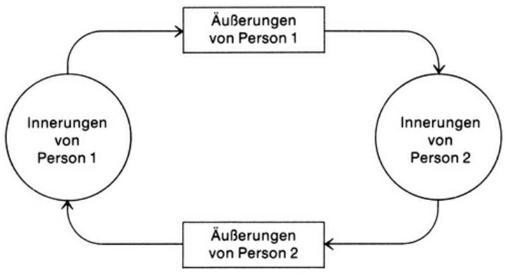

Der Grundvorgang der zwischenmenschlichen Kommunikation ist schnell beschrieben. Da ist ein Sender, der etwas mitteilen möchte. Er verschlüsselt sein Anliegen in erkennbare Zeichen – wir nennen das, was er von sich gibt, seine Nachricht. Dem Empfänger obliegt es, dieses wahrnehmbare Gebilde zu entschlüsseln. Häufig machen Sender und Empfänger von der Möglichkeit Gebrauch, die Güte der Verständigung zu überprüfen: Dadurch, dass der Empfänger zurückmeldet, wie er die Nachricht entschlüsselt hat, wie sie bei ihm angekommen ist und was sie bei ihm angerichtet hat, kann der Sender halbwegs überprüfen, ob seine Sende-Absicht mit dem Empfangsresultat übereinstimmt. Eine solche Rückmeldung heißt auch Feedback.

Wenn ich als Mensch etwas von mir gebe, bin ich auf vierfache Weise wirksam. Jede meiner Äusserungen enthält, ob ich will oder nicht, enthält vier Botschaften gleichzeitig:

* ein Sachinhalt (worüber ich informiere)
* eine Selbstoffenbarung (was ich von mir zu erkennen gebe)
* einen Beziehungshinweis (was ich von dir halte und wie ich zu dir stehe)
* einen Appell (was ich bei dir erreichen möchte)

## Sachinhalt

Der **Sachinhalt** ist meist direkt ausgesprochen, wir sagen: "explizit". Im professionellen Kontext spielt er die Hauptrolle oder *sollte* er die Hauptrolle spielen.

Auf der Sachebene eines Gesprächs gilt zum einen das *Wahrheitskriterium* wahr oder unwahr (zutreffend / nicht zutreffend), zum anderen das Kriterium der *Relevanz*: Sind die angeführten Sachverhalte für das anstehende Thema von Belang oder nicht? Zum Dritten erscheint das Kriterium der *Hinlänglichkeit*: Sind die angeführten Sachhinweise für das Thema ausreichend, oder muss vieles andere auch bedacht sein?

Der Gesprächspartner hat somit auf der Sachebene viele Möglichkeiten "einzuhaken":

 * er kann die Wahrheit der Sachverhalte anzweifeln
 * er kann die Relevanz bezweifeln (die vorgetragenen Sachargumente stehen zum aktuellen Thema in keiner Beziehung)
 * er kann die Hinlänglichkeit der Argumente anzweifeln in dem die Argumente in ihrer Bedeutung relativiert werden (z.B. durch hinzufügen von weiteren Sachargumenten oder die Kontroverse in eine grösseren Zusammenhang stellt).

Die Sachebene des Gesprächs ist von grosser Bedeutung. die sach- und menschengerechten Lösungen stehen und fallen nicht selten mit der Qualität des Diskurses auf dieser Ebene.

## Selbstoffenbahrung

Immer wenn ich etwas *von* mir gebe, gebe ich auch etwas von *mir* kund! Jede Äusserung enthält auch, ob ich will oder nicht, eine Selbstoffenbahrung. Sie enthält einen Hinweis darauf, was in mir vorgeht, wie mir ums Herz ist, wofür ich stehe und wie ich meine Rolle auffasse. Dies kann wiederum *explizit* geschehen ("Ich"-Botschaft) oder *implizit*.

Der Begriff Selbstoffenbahrung beinhaltet sowohl die gewollte Selbstdahrstellung als auch die unfreiwillige Selbstenthüllung.

## Beziehungshinweis

Ob man will oder nicht, wenn man jemanden anspricht, gibt man (durch Formulierung, Tonfall, Begleitmimik, Körperhaltung, etc.) auch zu erkennen, wie ich zum Anderen stehe und was ich von ihm halte - jedenfalls bezogen auf den aktuellen Gesprächsgegenstand. In jeder Äusserung steckt somit auch ein *Beziehungshinweis*, für welchen der Empfänger oft ein besonders sensibles und empfindliches Ohr besitzt.

Tatsächlich werden Beziehungssignale meist *implizit* und *zwischen den Zeilen* gesendet. Das Nicht-Sprachliche, der Tonfall in der Stimme, die Mimik im Gesicht spielen hier eine viel grössere Rolle, als der sachorientierte Sender ahnt. Diese Kommunikationsebene ist besonders störanfällig, wenn die Beziehung überhaupt angespannt, belastet oder unklar ist. Darum geht es letztlich um Beziehungsverbesserung, denn in einer intakten Beziehung muss ich nicht jedes Wort auf die Goldwaage legen. Die soziale Kompetenz, die auf der Sachebene begann erweitert sich hier um eine zwischenmenschliche Dimension.

Oft wird eine Beziehungsstörung auf der Sachebene ausgetragen und man kommt weder sachlich noch menschlich weiter. In diesem Fall ist es hilfreich zunächst die Störung auf der Beziehungsebene zu klären und wenn möglich zu beheben, bevor man wieder zur Sache zurückkommt.

Streng genommen ist der Beziehungshinweis natürlich ein spezieller Teil der Selbstoffenbarung. Jedoch wollen wir diesen Beziehungsaspekt als davon unterschiedlich behandeln, weil die psychologische Situation des Empfängers verschieden ist: Beim Empfang der Selbstoffenbarung ist er ein nicht selbst betroffener Diagnostiker ("Was sagt mir deine Äußerung über dich aus?"), beim Empfang der Beziehungsseite ist er selbst "betroffen" (oft im doppelten Sinn dieses Wortes).

Des weiteren enthält die Beziehungsseite aber auch eine Botschaft darüber, wie der Sender die Beziehung zwischen sich und dem Empfänger sieht ("so stehen wir zueinander"). Wenn jemand einen anderen fragt: "Na, und wie geht es in der Ehe?" – dann enthält diese Sach-Frage implizit auch die Beziehungsbotschaft: "Wir stehen so zueinander, dass solche (intimen) Fragen durchaus möglich sind."

Während also die Selbstoffenbarungsseite (vom Sender aus betrachtet) Ich-Botschaften enthält, enthält die Beziehungsseite einerseits Du-Botschaften und andererseits Wir-Botschaften.

## Apell

Kaum etwas wird «nur so» gesagt – fast alle Nachrichten haben die Funktion, auf den Empfänger Einfluss zu nehmen. In unserem Beispiel lautet der Appell vielleicht: «Gib ein bisschen Gas, dann schaffen wir es noch bei grün!» Die Nachricht dient also (auch) dazu, den Empfänger zu veranlassen, bestimmte Dinge zu tun oder zu unterlassen, zu denken oder zu fühlen. Dieser Versuch, Einfluss zu nehmen, kann mehr oder minder offen oder versteckt sein – im letzteren Falle sprechen wir von Manipulation. Der manipulierende Sender scheut sich nicht, auch die anderen drei Seiten der Nachricht in den Dienst der Appellwirkung zu stellen. Wenn Sach-, Selbstoffenbarungs- und Beziehungsseite auf die Wirkungsverbesserung der Appellseite ausgerichtet werden, werden sie funktionalisiert, d.h. spiegeln nicht wider, was ist, sondern werden zum Mittel der Zielerreichung.

Für Führungskräfte hat der Apell eine besondere Bedeutung, denn der Führungsauftrag enthällt die Herausforderung, Menschen zu leiten, zu bewegen und zu motivieren. Wenn ich das Wort ergreife und an jemanden richte, will ich auch Einfluss nehmen. Ich will den anderen nicht nur "erreichen", sondern auch etwas "bei ihm erreichen".

Vorsicht ist geboten, wenn jemand ein Hinderniss überwinden muss. Es besteht die Gefahr, dass man in solchen Situationen doppelt forsch auftritt. Doppelte Forschheitbeim Ablehnen eines Wunsches löst in der Regel auch doppelte Reaktanz aus. Ein "Nein" kann leichter verdaut werden, wenn es mit einem "Ja" auf der Beziehungsebene verbunden ist.

## Die Nachricht als Gegenstand der Kommunikationsanalyse

TODO

<!--

## Grundlagen der Kommunikationspsychologie

#### Apell

Auf der anderen Seite sollte eine Führungskraft auch das Appell-Ohr gut ausbilden. Welche Wünsche und Erwartungen werden an mich, offen oder verdeckt, herangetragen? Es geht dabei darum, ein offenes Ohr für Wünsche zu entwickeln. Nicht, um sie unbedingt alle zu erfüllen, sondern um sie zu kennen, sich mit ihnen auseinander zu setzen und dem Mitarbeiter gehör zu verschaffen. Dieses "Gehör", dieses "Ernst genommen werden" kann wichtiger sein als die Wunscherfüllung selbst.

**TODO: alles in der 3. Form (ohne ich)**

### Teufelskreise

Wir kommen nun von der *Kommunikation* zur *Interaktion*, dem Hin und Her von Äusserung und Antwort, von Aktion und Reaktion. Im Unterschied zu Theorien und Mo, die das seelische Geschehen des Individuums in den Block nehmen (Klassische Psychoanalyse, Indiviualpsychologie, Humanistische PsychologieI, wirft das folgende Schema einen Block auf das *Zwischen*-Menschliche, auf die Beziehungsdynamik. Dies ist die Blickrichtung der Systemischen Psychologie, so genannt, weil sie das Verhalten und Erleben des Menschen nicht aus seiner innerseelischen Dynamik begreift, sondern aus den Gegebenheiten des sozialen Systems, innerhalb dessen er seinen Platz hat.

Die «Systemtherapie» geht davon aus, dass die Ursache von Kommunikationsschwierigkeiten nicht (in erster Linie) beim einzelnen Menschen zu suchen sind, sondern im (Fehl-)Funktionieren des ganzen Regelsystems. Keiner ist "schuldig", sondern alle spielen nach den geltenden Regeln, niemand ist "krank", "pathologisch", "unreif" oder "bösartig", sondern der Einzelne zeigt ein Symptom, das für die Erhaltung des Gesamtsystems auf verborgene Weise unentbehrlich ist; unter diesem Blickwinkel ist der Fehler nicht länger beim Einzelnen, sondern im Regelkreis des Miteinander-Agierens und Aufeinander-Reagierens zu suchen.

Das folgende Schema ist vor allem für die Erfassung der Situation der Beziehung zweier Menschen elementar:

In diesem Modell gibt es keinen Anfang und kein Ende. Die Wahrnehmung bzw. die

### Das innere Team

TODO S. 45

### Das Werte- und Entwicklungsquadrat

TODO S. 52

### Situationsmodell

TODO S. 59

-->