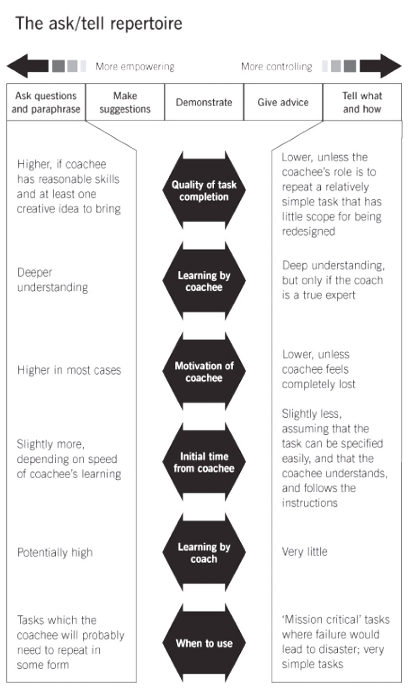

# Coaching

Bei coaching geht es um

* Beratung ohne Ratschlag
* Methode, damit Coachee selber Lösungswege findet

Zu beachten gilt es

* Es können nur Personen gecoached werden welche es auch wirklich wollen
* Es kann nur eine Verhaltensentwicklung auf einmal gechoached werden
* Kleine Schritte sind motivierend und sind nachhaltig

## Eigenschaften eines Coaches

### Ingorant

* Stellt viele Fragen und gibt keine Lösungen vor
* Bleibt neutral

### Schizophren

* Stellt die gleichen Fragen von verschiedenen Blickwinkeln aus

### Sadistisch

* Lässt nicht locker
* bohrt nach und stellt auch unangenehme Fragen

## Asking versus telling

Coaching can be done in different ways depending on the situation, the skills of the coachee or the task to be completed, coaching can be achieved by:

* Asking questions
* Make suggestions
* Demonstrate
* Give advice
* Tell what and how

Each of these options has its advantages and disadvantages. The coach might have to analyze the situation first and adapt the method used depending on:

* Skills of coaches
* Task to be performed (is it a repetitive or a creative task)
* Time constraints
* Failure tolerance

### STAR Formel

#### Situation

Als Basis für die anstehende Weiterentwicklung dienen die Fakten oder Resultate. Bei Minderleistungen geht es darum herauszufinden welches persönliche Verhalten dazu geführt hast, dass die Leistung nicht erbracht wurde.

* Was ist die Ausgangssituation?
* Was hat dazu geführt, dass das Ziel nicht erreicht wurde?

#### Target

Bevor irgendwelche Aktvivitäten definiert und eingeleitet werden, ist es von zentraler Bedeutung, zuerst ein klares Zielfoto "Target" zu formulieren. Das heisst, zu beschreiben, was in ein paar Wochen / Monaten konkret anders sein wird oder sein soll. Es geht in diesem Punkt weniger um konkrete Produktionsziele, sonder um zu entwickelnde Fähigkeiten des Coaches. Das Target kann sowohl vom Coachee als auch vom Coach (falls Vorgesetzter) formuliert werden.

* Wie sieht der angestrebte Zustand aus?
* Was konkret wird zum Zeitpunkt X anders sein?
* Was möchten Sie in X Wochen sagen können?

#### Actions

Um das Target zu erreichen, sind konkrete und verbindliche Aktivitäten notwendig. In dieser Phase geht es darum, die zielführendsten Tätigkeiten konkret auszuarbeiten. Zwecks Nachhaltigkeit und Motiviation sollte der Coachee wenn immer möglich die Aktivitäten selbst entwickeln. Allenfalls kann der Coache mit hypothetischen Fragen und Vorschlägen etwas nachhelfen.

* Was müssen Sie tun, um das Target zu erreichen?
* Wie möchten Sie konkret vorgehen?
* Was können Sie sonst noch tun .... ?
* .... und was auch noch?

#### Result

Eine klare Zielvereinbarung machen und terminieren.

* TODO

