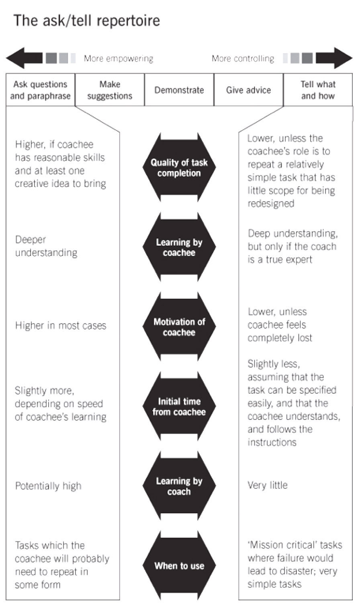

# Coaching

Bei coaching geht es um

* Beratung ohne Ratschlag
* Methode, damit Coachee selber Lösungswege findet

Zu beachten gilt es

* Es können nur Personen gecoached werden welche es auch wirklich wollen
* Es kann nur eine Verhaltensentwicklung auf einmal gechoached werden
* Kleine Schritte sind motivierend und sind nachhaltig

## Eigenschaften eines Coaches

### Ingorant

* Stellt viele Fragen und gibt keine Lösungen vor
* Bleibt neutral

### Schizophren

* Stellt die gleichen Fragen von verschiedenen Blickwinkeln aus

### Sadistisch

* Lässt nicht locker
* bohrt nach und stellt auch unangenehme Fragen

## Asking versus telling

Coaching can be done in different ways depending on the situation, the skills of the coachee or the task to be completed, coaching can be achieved by:

* Asking questions
* Make suggestions
* Demonstrate
* Give advice
* Tell what and how

Each of these options has its advantages and disadvantages. The coach might have to analyze the situation first and adapt the method used depending on:

* Skills of coaches
* Task to be performed (is it a repetitive or a creative task)
* Time constraints
* Failure tolerance

### STAR Formel

#### Situation

Als Basis für die anstehende Weiterentwicklung dienen die Fakten oder Resultate. Bei Minderleistungen geht es darum herauszufinden welches persönliche Verhalten dazu geführt hast, dass die Leistung nicht erbracht wurde.

* Was ist die Ausgangssituation?
* Was hat dazu geführt, dass das Ziel nicht erreicht wurde?

#### Target

Bevor irgendwelche Aktvivitäten definiert und eingeleitet werden, ist es von zentraler Bedeutung, zuerst ein klares Zielfoto "Target" zu formulieren. Das heisst, zu beschreiben, was in ein paar Wochen / Monaten konkret anders sein wird oder sein soll. Es geht in diesem Punkt weniger um konkrete Produktionsziele, sonder um zu entwickelnde Fähigkeiten des Coaches. Das Target kann sowohl vom Coachee als auch vom Coach (falls Vorgesetzter) formuliert werden.

* Wie sieht der angestrebte Zustand aus?
* Was konkret wird zum Zeitpunkt X anders sein?
* Was möchten Sie in X Wochen sagen können?

#### Actions

Um das Target zu erreichen, sind konkrete und verbindliche Aktivitäten notwendig. In dieser Phase geht es darum, die zielführendsten Tätigkeiten konkret auszuarbeiten. Zwecks Nachhaltigkeit und Motiviation sollte der Coachee wenn immer möglich die Aktivitäten selbst entwickeln. Allenfalls kann der Coache mit hypothetischen Fragen und Vorschlägen etwas nachhelfen.

* Was müssen Sie tun, um das Target zu erreichen?
* Wie möchten Sie konkret vorgehen?
* Was können Sie sonst noch tun .... ?
* .... und was auch noch?

#### Result

Eine klare Zielvereinbarung machen und terminieren.

* TODO

## Feedback geben

Feedback Prozess:

1. Abholen beim Gegenüber, wie er/sie eine Situation einschätzt. "Wie siehst Du die aktuelle Situation im Thema?"
2. An Aussagen des Gegenübers anknüpfen und eigenes Feedback (FEZ) geben. "Danke für Deine Einschätzung, Wenn ich Dich richtig verstehe, dann ... meine Beobachtung ist ...".
3. Beim Gegenüber nachfrage, wie er/sie das Feedback verstanden hat. "Was nimmst Du für Dich aus dem Feedback mit?"

#### Fedback geben: Was mache ich wenn ..

###### der die Mitarbeitende sich rechtfertigt ....

Es ist wichtig, bereits im Vorfeld des Feedbacks dem Mitarbeiter zu sagen, dass er/sie sich im Feedback nicht rechtfertigen muss. Sollte der Mirarbeitende sich rechtfertigen sollte man ihn unterbrechen: "Ich möcht Dir meine Wahrnehmung mitteilen, Du musst Dich nicht rechtfertigen".

Sich rechtfertigen und eine anschliessende Diskussion, Lösungsfindung oder gar eine Begründung ist nicht ganz das gleiche. Eine Rechtfertigung ist eine einseitige Argumentation und eine Abwehrhaltung. Durch eine Rechtfertigung versuchen wir eine unserer Meinung nach richtige Handlung zu erklären. Sie soll andere Menschen davon überzeugen, dass wir Recht haben – wir „fertigen“ quasi unser Recht.

Die Rechtfertigung kommt aus einer Haltung, in der Du Dich entweder kleiner machst als du bist oder grösser:

* sie hat einen Unterton von Entschuldigung
* oder einen von Trotz
* oder auch von Aggression und Empörung
* und hat meist ein schlechtes Gewissen im Fahrwasser

Der Unterschied zwischen einer Begründung und einer Rechtfertigung liegt in der inneren Haltung mit der man Erklärt warum die Dinge so sind wie sie sind. Es kann sich im strengsten Fall sogar um ein und denselben Satz handeln. Einmal wird er als Begründung gesendet, beim anderen Mal als Rechtfertigung.

Eine Begründung kommt jeweils auf Augenhöhe daher:

* sie ist eine klare Aussage
* sie erklärt was warum geschehen ist oder geschehen soll
* sie entspringt einem reinen Gewissen
* sie kennt das Konzept der Schuldzuweisung nicht

###### .... der/die Mitarbteitende in Gedanken versunken ist

Mitarbeitende verarbeiten unmittelbar die Rückmeldungen und können so fot das Feedback gar nicht bis zum Schluss verfolgen. In diesem Fall den Mitarbeitenden darauf ansprechen: "Irgendwie habe ich das Gefühl, dass Du gerade in Gedanken versunken bist. An was denkst Du im Moment?"

#### FEZ Formel

##### Fakten

Was habe ich wahrgenommen, gesehen, gehört? Mit beweisbaren Fakten kommunizieren und persönliche Interpretationen oder Pauschalaussagen vermeiden.

##### Emotion

Die eigenen Gefühle explizit benennen und versuchen zu beschreiben was die Beobachtung konkret ausgelöst hat. Zum Beispiel "Es freut, belastet, irritiert, überrrascht micht ....".

##### Ziel

Geben Sie dem Feedbacknehmer konkrete Empfehlungen, wie er eine Aufgabe besser lösen kann. Als Feedbackgeber ist es empfehlensert zu fragen, was vom Feedback verstanden wurde. Zum Beispiel "Ich empfehle Dir, ich erwarte von Dir, Ich wünsche mir ....".

